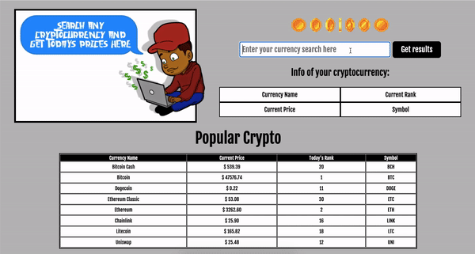

## 💻 Goal
Enable a user to enter any crytocurrency and receive today's standings on that given currency.

## 💻 How it's made
Made using HTML, CSS, Javascript, API and JSON.

## 💻 Lesson Learned
It's harder to work with API's when you don't totally understand the concept of cryptocurrency.. 
